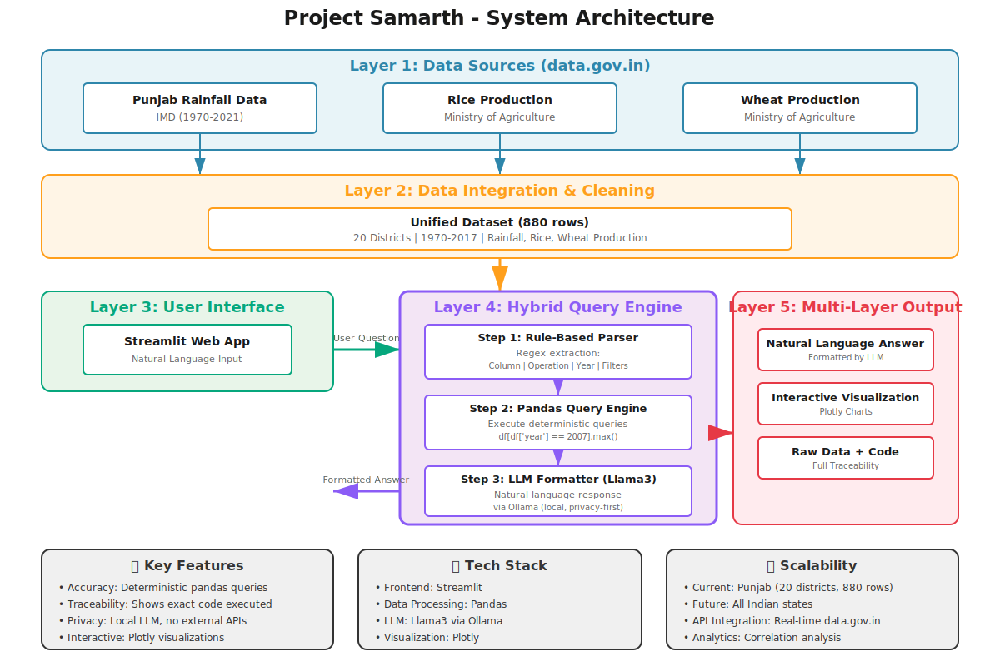

# 🌾 PB_CropTrack - Punjab Agriculture Q&A System

An intelligent question-answering system over agricultural and climate data from **data.gov.in**, enabling natural language queries with interactive visualizations and complete traceability.

---

## 🎯 Project Overview

This system allows users to ask complex questions about Punjab's agricultural economy and climate patterns in **natural language** and receive accurate, traceable answers backed by government data - complete with interactive visualizations.

### ✨ Key Capabilities

**Simple Queries:**
```
"Which district received the highest rainfall in 2007?"
"What was the average rice production in 2000?"
```

**Trend Analysis:**
```
"Show rice production trend from 2000 to 2010"
"Rainfall pattern over the last 15 years"
```

**Comparative Analysis:**
```
"Compare rainfall between Amritsar and Ludhiana from 2001 to 2010"
"Top 5 districts by wheat production in 2015"
```

---

## 🏗️ System Architecture



### Hybrid Three-Layer Approach

```
User Question → Rule-Based Parser → Pandas Query Engine → LLM Formatter → Answer + Viz + Code
```

#### **Layer 1: Rule-Based Parser**
- Uses regex to extract intent (column, operation, year, filters)
- **Fast** and **deterministic**
- Handles: min, max, avg, sum, trends, comparisons, top-N

#### **Layer 2: Pandas Query Engine**
- Executes SQL-like queries on structured data
- **100% traceable** - shows exact code executed
- Handles edge cases (missing data, invalid years)

#### **Layer 3: LLM Formatter**
- Uses **Llama3 via Ollama** (local, privacy-first)
- Converts results to natural language
- **No external API calls** - all processing on-premise

### Why This Architecture?

| Approach | Accuracy | Speed | Traceability | Privacy |
|----------|----------|-------|--------------|---------|
| **Pure LLM (RAG)** | ⚠️ Medium | 🐌 Slow | ❌ No | ⚠️ API Dependent |
| **Our Hybrid** | ✅ High | ⚡ Fast | ✅ Full | ✅ Local |

---

## 📊 Dataset Information

**Source:** [data.gov.in](https://data.gov.in)  
**Ministries:** Ministry of Agriculture & Farmers Welfare, India Meteorological Department (IMD)

### Dataset Details
- **Rows:** 880 records
- **Districts:** 20 Punjab districts
- **Time Period:** 1970-2017 (47 years)
- **Columns:** 
  - `district` - District name
  - `year` - Year of record
  - `rainfall` - Annual rainfall (mm)
  - `rice_production` - Rice production volume
  - `wheat_production` - Wheat production volume

### Original Data Sources
1. **Punjab Rainfall Data**  
   [District-wise Annual Average Rainfall Punjab (1970-2021)](https://www.data.gov.in/resource/district-wise-annual-average-rainfall-punjab-1970-2021)  
   *India Meteorological Department*

2. **Punjab Rice Production**  
   [District-wise Production under Rice Cultivation Punjab (1968-2018)](https://www.data.gov.in/resource/district-wise-production-under-rice-cultivation-punjab-1968-2018-april-march-0)  
   *Ministry of Agriculture & Farmers Welfare*

3. **Punjab Wheat Production**  
   [District-wise Production under Wheat Cultivation Punjab (1968-2018)](https://www.data.gov.in/resource/district-wise-production-under-wheat-cultivation-punjab-1968-2018-april-march-0)  
   *Ministry of Agriculture & Farmers Welfare*

**Downloaded:** October 18, 2025

---

## 🚀 Installation & Setup

### Prerequisites
- Python 3.8+
- [Ollama](https://ollama.ai) installed and running

### Step 1: Clone Repository
```bash
git clone <your-repo-url>
cd punjab-agriculture-qa
```

### Step 2: Install Dependencies
```bash
pip install -r requirements.txt
```

**requirements.txt:**
```
pandas>=2.0.0
streamlit>=1.28.0
ollama>=0.1.0
plotly>=5.18.0
```

### Step 3: Setup Ollama
```bash
# Install Ollama from https://ollama.ai

# Pull Llama3 model
ollama pull llama3

# Start Ollama server (in a separate terminal)
ollama serve
```

### Step 4: Prepare Data
Ensure your data file is at: `data/Punjab_Agri_Rainfall_Cleaned.csv`

### Step 5: Run the Application
```bash
streamlit run app.py
```

The application will open at **http://localhost:8501**

---

## 💻 Usage Guide

### Web Interface

1. **Launch the app** → `streamlit run app.py`
2. **Select a sample question** or type your own
3. **Click "Ask"** to get results
4. **Explore results** in four tabs:
   - **📝 Answer:** Natural language response with citations
   - **📊 Visualization:** Interactive Plotly charts (trends, comparisons, rankings)
   - **📋 Data:** Raw data supporting the answer
   - **💻 Code:** Exact pandas query executed

### Sample Questions to Try

**Basic Queries:**
- Which district received the highest rainfall in 2007?
- What was the average rice production in 2000?
- Show top 5 districts by wheat production in 2015

**Trend Analysis:**
- Show rice production trend from 2000 to 2010
- Rainfall pattern over the last 15 years
- Wheat production trend from 1990 to 2000

**Comparative Analysis:**
- Compare rainfall between Amritsar and Ludhiana from 2001 to 2010
- Compare wheat production between Patiala and Jalandhar in 2005

---

## 🎨 Features

### ✅ Multi-Layer Traceability
Every answer includes:
- **Natural language explanation** (LLM-formatted)
- **Raw data evidence** (exact rows/values)
- **Executable code** (pandas query)
- **Source citation** (dataset from data.gov.in)

### 📊 Interactive Visualizations
- **Line charts** for trends over time
- **Bar charts** for rankings and comparisons
- **Multi-line charts** for district comparisons
- **Zoom, pan, hover** for detailed exploration
- **Download as PNG** capability

### 🔒 Privacy-First Design
- **Local LLM** (Llama3 via Ollama)
- **No external API calls**
- **All processing on-premise**
- **Government-ready** for secure deployments

### ⚡ Fast & Accurate
- **Deterministic queries** (no hallucinations)
- **Response time:** 2-3 seconds
- **Regex-based parsing** (instant intent extraction)

---

## 🧠 Technical Implementation

### Core Components

**1. Query Parser (`parse_and_query`)**
```python
# Extracts intent from natural language
# Returns: result, code, error, viz_data
```
- Identifies: column, operation (min/max/avg/trend), year/range, filters
- Supports: single year, year ranges, last N years
- Handles: rainfall, rice_production, wheat_production

**2. Pandas Query Engine**
```python
# Executes deterministic queries
df[df['year'] == 2007].loc[df['rainfall'].idxmax()]
```
- Fast, accurate, traceable
- Returns exact DataFrames/Series
- Handles edge cases gracefully

**3. Visualization Engine**
```python
# Creates interactive Plotly charts
# Auto-detects: line (trends) vs bar (rankings/comparisons)
```
- Line charts for time-series
- Bar charts for rankings
- Multi-line for comparisons

**4. LLM Formatter**
```python
# Formats results into natural language
# Uses: Llama3 via Ollama
```
- Natural conversational tone
- Cites sources
- Fallback if LLM unavailable

### Example Flow
```
Question: "Show rice production trend from 2000 to 2010"
    ↓
Parser: {operation: 'trend', column: 'rice_production', years: [2000-2010]}
    ↓
Pandas: df[(df['year'] >= 2000) & (df['year'] <= 2010)].groupby('year')['rice_production'].mean()
    ↓
Visualization: Line chart with 11 data points
    ↓
LLM: "Rice production showed a steady increase from 2000 to 2010..."
```

---

## 📁 Project Structure

```
punjab-agriculture-qa/
├── app.py                              # Main Streamlit application
├── data/
    └── Production_Rice_1.csv   # Rice production dataset
    └── Production_Wheat_1.csv   # Wheat production dataset
    └── AnnualAverageRainFall.csv   # Rainfall dataset
│   └── Punjab_Agri_Rainfall_Cleaned.csv   # Integrated dataset
├── architecture.png                    # System architecture diagram
├── requirements.txt                    # Python dependencies
└── README.md                          # This file
```

---

## 📈 Current Capabilities vs Future Enhancements

### ✅ Current (v1.0)

- ✅ Punjab state coverage (20 districts)
- ✅ 47 years of historical data (1970-2017)
- ✅ 3 data types (rainfall, rice, wheat)
- ✅ 7 query types (min, max, avg, sum, trend, compare, top-N)
- ✅ Interactive visualizations
- ✅ Complete traceability
- ✅ Local LLM (privacy-first)

### 🔮 Future (v2.0+)

**Phase 1: Geographic Expansion**
- Add all Indian states (28 states, 8 UTs)
- Support cross-state comparisons
- Include more crops (cotton, sugarcane, pulses)

**Phase 2: Real-Time Integration**
- Direct API connection to data.gov.in
- Automatic data refresh
- Live data streaming

**Phase 3: Advanced Analytics**
- Correlation analysis (rainfall ↔ production)
- Predictive modeling (ML/time-series)
- Climate impact assessment
- Policy recommendation engine

**Phase 4: Enhanced UX**
- Voice input support
- Multi-language (Hindi, Punjabi)
- Export reports (PDF/Excel)
- Email alerts for data updates

---

## 🛡️ Design Principles

### ✅ Accuracy & Traceability
- Every answer shows **exact code executed**
- **Raw data** always accessible
- **Source dataset** clearly cited
- **No black box** - complete transparency

### 🔒 Data Sovereignty & Privacy
- **Local LLM** (no external API calls)
- All processing **on-premise**
- No data leaves the system
- Can be deployed in **secure government environments**
- Compliant with data residency requirements

### ⚡ Speed & Reliability
- **Deterministic queries** (no hallucinations)
- **Regex parsing** (milliseconds)
- **Pandas** (optimized for structured data)
- **Caching** for repeated queries

---

## 🐛 Known Limitations

### Current Scope
- ⚠️ **Geographic:** Limited to Punjab (by design for PoC)
- ⚠️ **Crops:** Only rice and wheat (can add more)
- ⚠️ **Time:** Data up to 2017 (static dataset)

### Query Patterns
- ⚠️ Requires specific keywords (rainfall, rice, wheat, highest, trend, etc.)
- ⚠️ District names must match exactly (case-insensitive)
- ⚠️ Year must be in dataset range (1970-2017)

### Technical
- ⚠️ Local LLM requires computational resources (4GB+ RAM)
- ⚠️ First query may be slow (model loading)
- ⚠️ No authentication/multi-user support yet

**None of these are architectural limitations - all can be addressed in future versions.**

---

## 🎓 What I Learned

### Technical Skills
- **Data integration** from disparate government sources
- **Hybrid AI architectures** (rule-based + LLM)
- **Local LLM deployment** with Ollama
- **Interactive visualizations** with Plotly
- **Production-ready web apps** with Streamlit

### Domain Knowledge
- **Government data ecosystems** (data.gov.in structure)
- **Agricultural data patterns** (seasonal, geographic variations)
- **Climate-agriculture relationships**

### Design Decisions
- **Why hybrid over pure LLM:** Accuracy + traceability
- **Why local LLM:** Privacy and data sovereignty
- **Why Streamlit:** Rapid prototyping + production quality
- **Why Plotly:** Interactive, export-friendly charts

---

## 🙏 Acknowledgments

- **Data Source:** [data.gov.in](https://data.gov.in) - Government of India's Open Data Platform
- **Ministry of Agriculture & Farmers Welfare** - Crop production datasets
- **India Meteorological Department (IMD)** - Rainfall data
- **Ollama Team** - Local LLM infrastructure
- **Project Samarth** - For this challenging and impactful problem statement

---

## 👤 Author

**Niharika Khanna**  


📧 Email: khanna.niharika09@gmail.com  
🔗 LinkedIn: [nkhanna94](https://linkedin.com/in/nkhanna94)  
💻 GitHub: [nkhanna94](https://github.com/nkhanna94)

---

## 📝 License

This project is created for Project Samarth evaluation purposes. The code is open for educational use. Data sources remain property of the Government of India.

---

## 🚀 Quick Start (TL;DR)

```bash
# Install dependencies
pip install pandas streamlit ollama plotly

# Setup Ollama
ollama pull llama3
ollama serve

# Run app
streamlit run app.py

# Ask: "Show rice production trend from 2000 to 2010"
```

**That's it! You're ready to explore Punjab agriculture data.** 🌾

---


---

<div align="center">

**Built with ❤️ for Project Samarth**

*Empowering data-driven agricultural policy decisions through intelligent Q&A systems*

[](https://data.gov.in)
[](https://ollama.ai)
[](LICENSE)

</div>